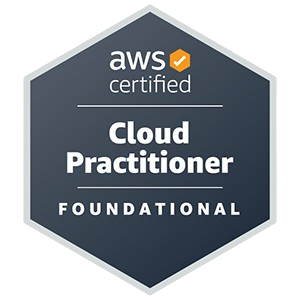

---

    

---
### Relevant Certs
 

  
  
  

 

Other Certs

 
    
  - **C#:**
     - Foundational C# with Microsoft.
  - **CompTIA:** 
     - A+ Core 1, and Core 2.
  - **Fortinet:** 
       - Network Security Expert 1, 2, and 3 certifications.
  - **Google:** 
     - Analytics for Beginners, Advanced Analytics, & Analytics Individual
Qualification.
  - **Kaseya:** 
     - VSA Certified Technician, BMS Certified Technician, IT Glue Admin 2, Certified
Professional, and Power User.
  - **MalwareBytes:** 
       - Incident Response, Endpoint Protection, and Detection and Response.

---

Feel Free To Reach Out With Interesting Projects!

